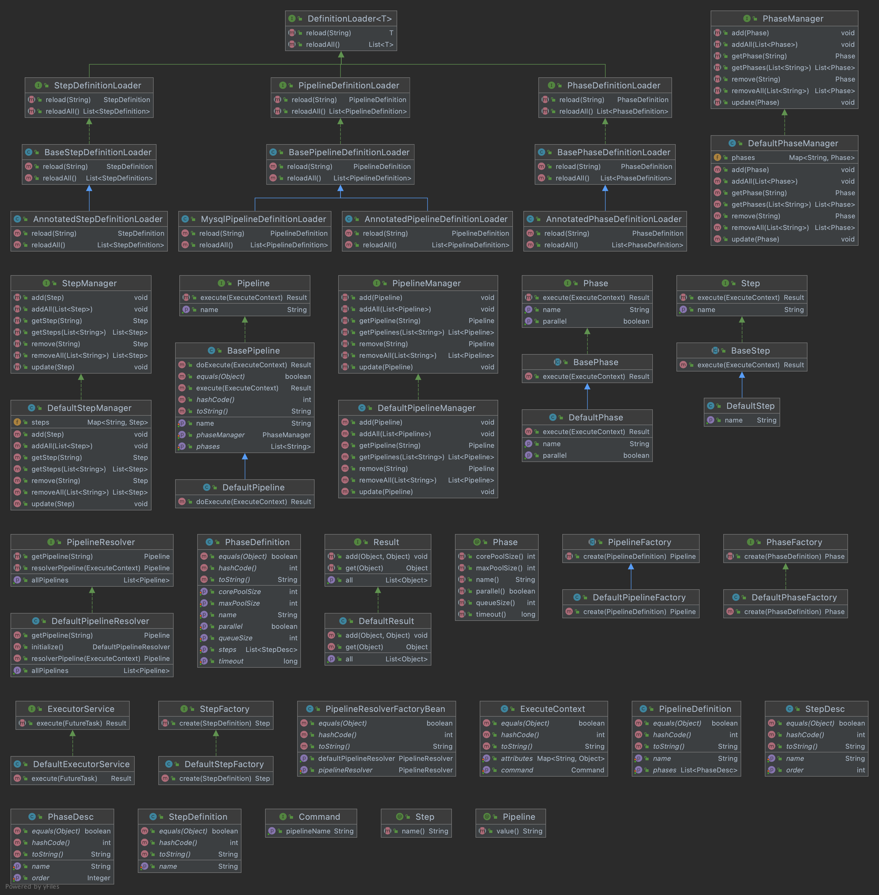

# pipeline


<p align="center">
  <a href="https://github.com/ken-xue/pipeline/blob/master/LICENSE">
    
  </a>
  <a href="https://www.oracle.com/java">
    
  </a>
</p>
<p align="center">
<a title="GitHub Watchers" target="_blank" href="https://github.com/ken-xue/pipeline/watchers"></a>  
  <a title="GitHub Stars" target="_blank" href="https://github.com/ken-xue/pipeline/stargazers"></a>  
  <a title="GitHub Forks" target="_blank" href="https://github.com/ken-xue/pipeline/network/members"></a>
</p>

<p align="center"><a title="Chinese" href="README.md"> 中文简体</a>  |  English</p>

## Introduction

> Lightweight process orchestration execution engine that supports loading processes from code and databases for execution.

## QuickStart

1.install
```java
git clone https://github.com/ken-xue/pipeline.git
cd pipeline
mvn clean install
```
2.import
```xml
<dependency>
    <groupId>io.kenxue.pipeline</groupId>
    <artifactId>pipeline</artifactId>
    <version>1.0.0</version>
</dependency>
```
3.add bean scan package

```java
@SpringBootApplication(scanBasePackages = { "io.kenxue.pipeline"})
```

## License

MIT see [LICENSE](./LICENSE).

## Class Graph


